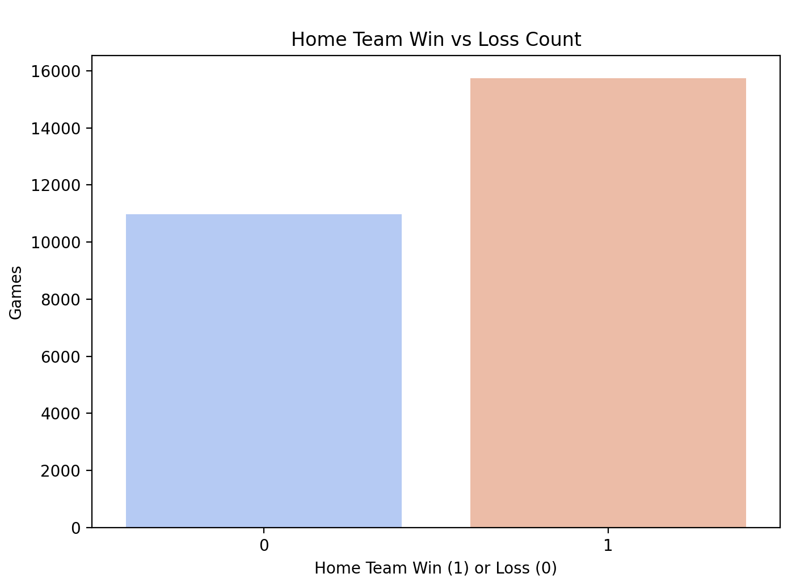
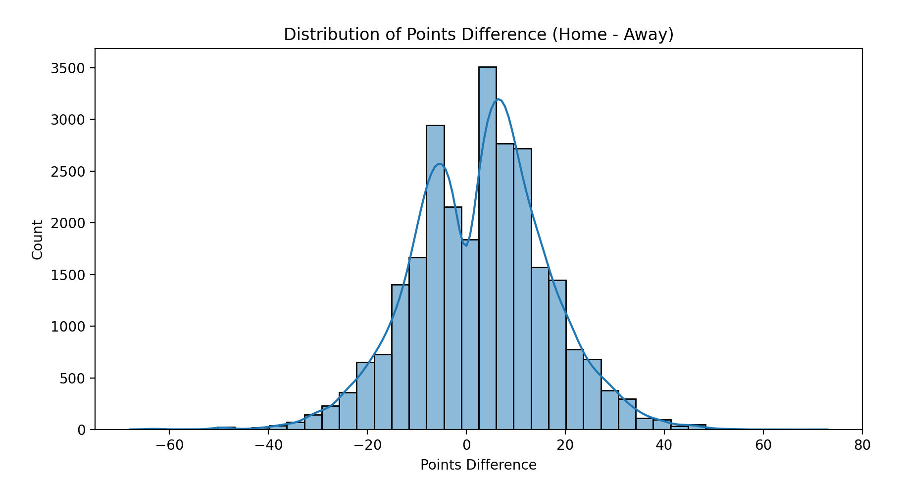
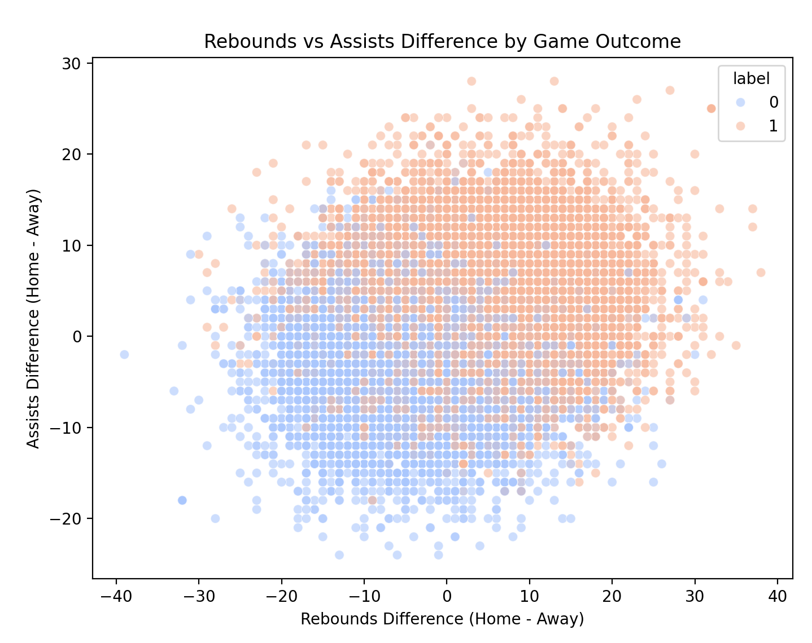
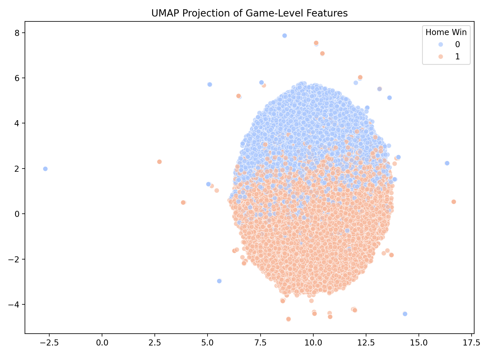

# EDA Summary

The dataset I chose to use for this project is the [Kaggle NBA games dataset](https://www.kaggle.com/datasets/nathanlauga/nba-games/data).

The data is organized into 5 files:

-   `games.csv`: the list of all games in the dataset. Includes final stats, date played, and who won
-   `games_details.csv`: per-player stats for each game
-   `players.csv`: consists of player names & season
-   `ranking.csv`: ranking of the teams on a given day
-   `teams.csv`: A list of all teams + some metadata about the team

The dataset contains all regular season NBA games from 2003-2022. Per the Kaggle page, this data was pulled directly via the [NBA API](https://github.com/swar/nba_api) ([official link](https://www.nba.com/stats)).

## Data Overview

The `games` table contains data for a total of 26651 games. At 82 games per season, and the dataset covering 19 seasons, this roughly matches the expected amount of 23370 games (82 games/season \* 19 seasons \* 30 teams / 2 teams/game). I'm assuming the slight overage is due to the dataset including finals + some additional games, which I'd prefer over having too few games. Checking for duplicates (by duplicate GAME_ID) results in a total of 30, so not enough to contribute heavily to the overage.

There are some missing values across tables.

`games` (top 10. Labeled by column name, followed by % of missing values):

-   FG3_PCT_home 0.003715
-   REB_away 0.003715
-   AST_away 0.003715
-   FG3_PCT_away 0.003715
-   FT_PCT_away 0.003715
-   FG_PCT_away 0.003715
-   PTS_home 0.003715
-   FG_PCT_home 0.003715
-   FT_PCT_home 0.003715
-   PTS_away 0.003715
-   AST_home 0.003715
-   REB_home 0.003715

As seen above, there is not much missing data in the games table. It appears that most missing values come from the earliest games (where all score-related values are missing), so those will be removed.

`games_details`:

-   NICKNAME 0.920678
-   COMMENT 0.835949
-   START_POSITION 0.617478
-   PLUS_MINUS 0.199440
-   FTM 0.164052
-   PTS 0.164052
-   PF 0.164052
-   TO 0.164052
-   BLK 0.164052
-   STL 0.164052

The largest amount of missing fields are in the nickname and comment fields, followed by START_POSITION. It's intuitive that the nickname and comment fields are much sparser, as most players don't have a nickname or need a comment. The START_POSITION field is expected to be fairly sparse as well, as not all players are starters.

The remaining missing data appears to be due to similar reasons as the missing data in `games`. The earlier games don't have as much information logged, so the majority of missing values come from those games. Since these games will be dropped, so will the details for these games which should handle most of the missing values.

## Key Variables

`HOME_TEAM_WINS`: 1 if the home team won, 0 if they lost. Will be used as my "Y"

All player stats: will be used for evaluating each players recent performance. I plan on using these as the primary features

All game score-related variables: might be used as features. I will try to avoid using these initially, as the scores won't be available in "real" usage.

## Findings

Home teams won 58.7% of games:

Showing a minor imbalance, but I don't think it's enough of one to be concerned about.

As seen from the graph below, most games are close. You can also see how the home teams tend to score higher, which matches up with the previous finding of home teams winning more. There are some blowout games for both home and away teams, but games are frequently close in score:

I wanted to find which features correlate with winning, as my plan is to weight "obvious" features heavier or lighter when evaluating players.

The above correlation chart didn't tell me a whole lot I didn't already know. For example, having a higher difference in points correlates to a higher chance of winning (duh). Similarly, having a high amount of turnovers (listed as TO_diff) results in a lower chance of winning.

While the chart didn't tell me anything I wouldn't have intuitively thought, it does give me some insight as to how much of an affect these features have on the outcome of the game. I think this will be helpful when it comes to weighting these features for scoring players. For example, I know that if a player has a high amount of turnovers in recent games, their "score" should be lower. Similarly, I should weight assists and rebounds higher than steals or blocks.

I also graphed the features with higher correlation (excluding PTS_diff). Intuitively, the results make sense. Features with high correlation lead to higher chances of winning at higher differences. I didn't learn anything from this, but I thought the resulting graph looked cool:

I also wanted to run UMAP on the dataset, as I found some very useful information from that during the previous assignments. I used the Home vs Away differences for each feature and applied UMAP, which resulted in the following:

To be honest, I'm not totally sure what to make of this. It shows a pretty clear separation in what results in a win vs a loss (with some outliers), but I'll need to play with it more to see if there's any information it provides that I didn't already know (but I'm not very hopeful...)
