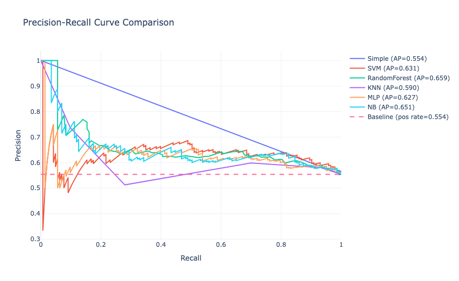
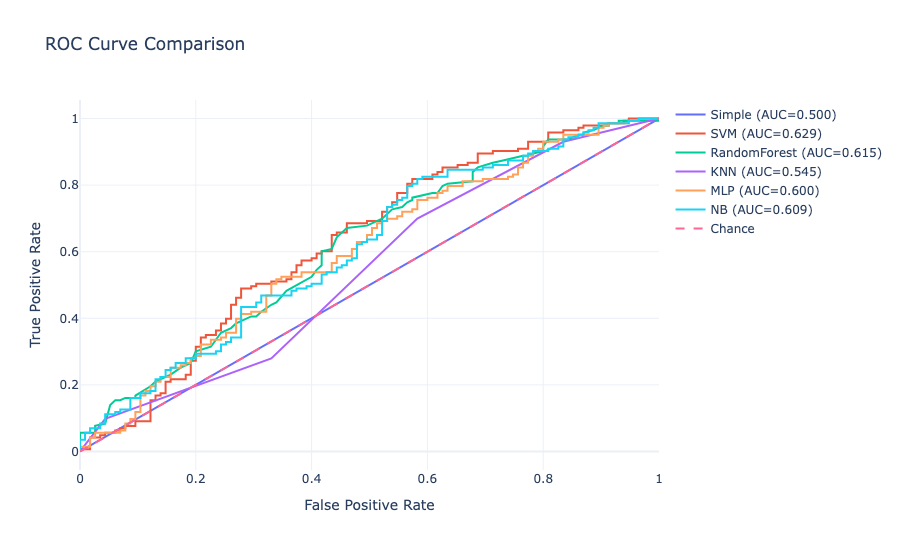

# **NBA Game Outcome Prediction Using the Four Factors**

Author: Connor Sullivan

## **1. Introduction**

This project looks at how well machine learning models can predict whether or not the home team will win during the NBA regular season. Instead of using advanced metrics (such as play-by-play data, which finding datasets for can be costly) or player‑level data, the focus is on the well‑known Four Factors, which are statistics to reflect shooting efficiency, turnovers, rebounding, and free‑throw rate. These stats are widely used in basketball analytics and give a straightforward view of what usually decides who wins a game.

The goal is to accurately predict the outcome of a game using these Four Factors, using multiple machine learning models:

-   Support Vector Machine
-   RandomForest
-   Naive Bayes
-   KNN
-   Multi-layer Perceptron

The results are compared against a simple baseline, which consists of guessing the home team will always win.

## **2. Data Overview**

Each sample in the dataset represents one regular season NBA game. For each game, both the home and away teams' Four Factors were calculated on a rolling average from the previous 10 games where they were in the same "position", along with a binary label of if the home team won or not. For example, the rolling average for the away team will use the 10 most recent games that team has been away, and the same for the home team. This should account for how well a team plays on their home court vs as a visitor.

### **2.1 Features Used**

For each team:

-   **eFG%**: shooting efficiency adjusted for 3‑pointers
-   **TOV%**: how often a team loses the ball
-   **ORB%**: how well a team rebounds its own missed shots
-   **FTR**: how often a team gets to the free‑throw line

### **2.2 Target Variable**

-   **HomeWin** (1 if home team wins, 0 if not)

### **2.3 Dataset Size**

-   Number of games: 51,861
-   Train/test split: The test set consists of all games for the 2025 season, and the training set consists of all remaining games

---

## **3. Methodology**

The analysis uses a standard machine learning workflow: clean the data, prepare the features, train the models, and compare their performance.

### **3.1 Preprocessing**

-   Remove missing or invalid rows
-   Scale the data for models that need it (SVM, KNN, MLP)
-   Create features representing differences between home and away teams
-   Split into train and test sets

### **3.3 Evaluation Metrics**

-   **Accuracy**
-   **ROC‑AUC**
-   **Precision/Recall**
-   Comparison to the baseline model

---

## **4. Results**

### **4.1 Overall Accuracy**

| Baseline | SVM    | RandomForest | KNN   | MLP  | NB   |
| -------- | ------ | ------------ | ----- | ---- | ---- |
| 0.55     | 0.6008 | 0.6008       | 0.574 | 0.62 | 0.55 |

(note that these scores are from 12/02/25. As the season progresses, they may vary)

General observations:

-   During the current test period, the home team wins 55% of the time, which sets our baseline
-   SVM and RandomForest performed identically (accuracy-wise)
-   Multi-Layer Perceptron performed best

---

## **5. Discussion**

The results show that even a small set of basic team statistics can predict NBA games better than a simple baseline. The Four Factors give a solid foundation because they capture the biggest drivers of game outcomes, while remaining fairly independent of each other. Note that there is some overlap, but even so, these factors still capture offensive and defensive "skill" on a normalized (0-1) scale.

Even though the models do not use player‑level or lineup data, the stronger models still show a meaningful improvement over guessing based on home‑court advantage alone. This suggests that the Four Factors contain a lot of the signal needed for simple prediction.

At the same time, I think there is still much room to improve upon. To get stronger predictions, the model would need more information such as player performance metrics, travel schedules, injuries, or accurate play-by-play data.

---

## **6. Conclusion**

Using the Four Factors, several standard machine learning models can predict NBA game outcomes reasonably well.

Future improvements could include:

-   Adding player‑level aggregated stats
-   Using matchup‑specific features
-   Including play-by-play data
-   Accounting for trades, injuries, or possibly off-court features

All supporting materials can be found in the linked GitHub repository.
